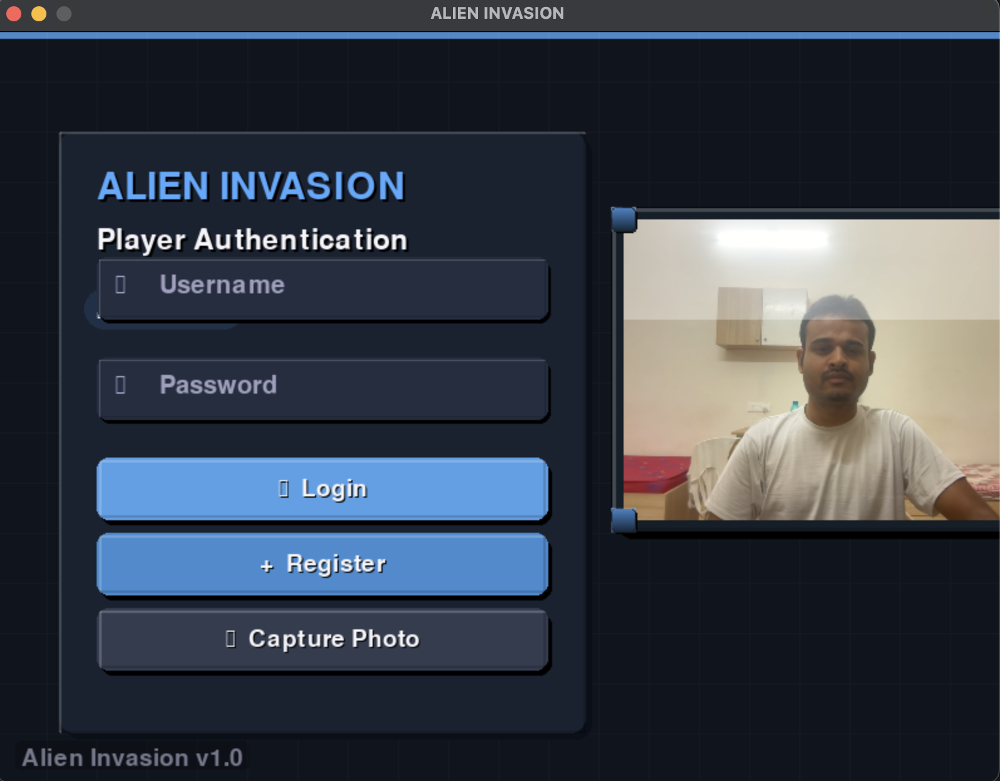

# Alien Invasion: Biometric Gesture Control 🎮🖐️

An innovative, gesture-controlled adaptation of the classic _Alien Invasion_ game. This project reimagines the original from **"Python Crash Course" by Eric Matthes**, integrating **OpenCV** and **MediaPipe** for real-time, hands-free interaction.

---

## 🚀 Project Overview

In this version of _Alien Invasion_, players control a spaceship using hand gestures captured via webcam. Moving your hand steers the ship, and opening your palm triggers automatic firing. This project explores the intersection of **computer vision** and **interactive game design**.

---

## 🖼️ Gameplay Screenshot

<p align="center">
  
</p>

---

## 🛠️ Technologies Used

- Python 3.x
- Pygame
- OpenCV
- MediaPipe
- NumPy

---

## 🎮 Gameplay Controls

| Action      | Gesture                                    |
| ----------- | ------------------------------------------ |
| Move Ship   | Move hand left or right (reversed control) |
| Fire Bullet | Open palm (fires every 4 seconds)          |
| Stop Firing | Close palm                                 |

---

## 📦 Installation & Setup

```bash
# 1. Clone the repository
git clone https://github.com/RanjitShahKanu024//alien_invasion.git
cd alien_invasion

# 2. Set up virtual environment
python3 -m venv myenv
source myenv/bin/activate   # On Windows: myenv\Scripts\activate

# 3. Install dependencies
pip install -r requirements.txt

# 4. Run the game
python alien_invasion.py
```
